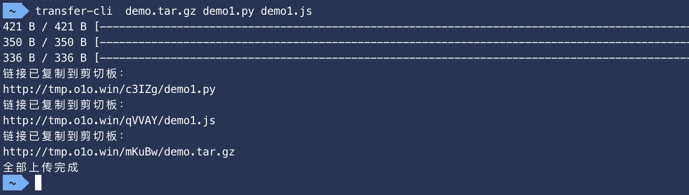

# transfer-cli
cli upload tool for [transfer.sh](https://github.com/dutchcoders/transfer.sh) mirror website http://tmp.o1o.win

After you put the executable file `transfer-cli` to `/usr/local/bin`, you can use it as belows

```
Usage:
  transfer-cli filename1 [filename2] [filename3] ...
```


